# 目录

- [Git](#git)
  - [安装地址](#安装地址)
  - [安装过程](#安装过程)
- [Tortoise-git图形化界面(小乌龟软件)](#tortoise-git图形化界面小乌龟软件)
  - [安装地址](#安装地址-1)
  - [安装过程](#安装过程-1)
- [GitHub](#github)
  - [访问网站](#访问网站)
  - [网站自动汉化插件安装方法及过程](#网站自动汉化插件安装方法及过程)
- [C/C++环境](#CC环境)
  - [安装地址](#安装地址-2)
  - [安装过程](#安装过程-2)
- [STM32环境](#STM32环境)
  - [需要安装](#需要安装容)
  - [安装过程](#安装过程-3)

---
---

# Git

## 安装地址
[https://git-scm.com/install](https://git-scm.com/install)

### 获取安装包
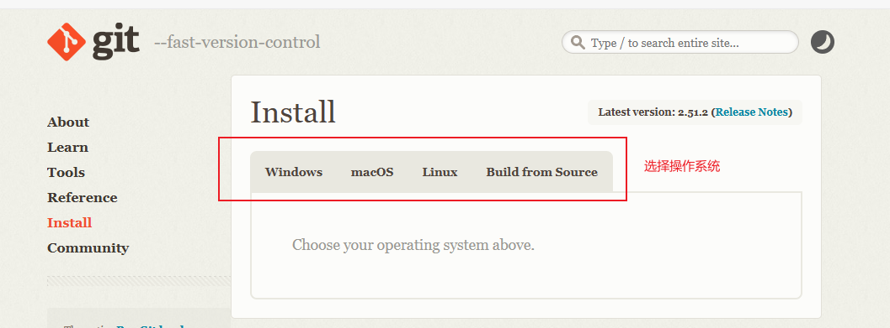

## 安装过程
### 运行安装包，默认配置选项即可。安装过程以下需注意配置：

### 选择第三方软件使用git（后续通过图形化界面软件使用git）
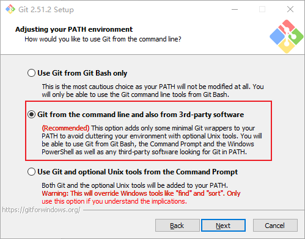

### 安装完成后，cmd中输入 git -v 可正确显示git软件版本
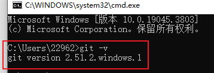

---
---

# Tortoise-git图形化界面(小乌龟软件)

## 安装地址
<https://tortoisegit.org/>

### 安装包获取
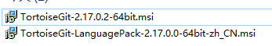

## 安装过程

#### 先完成安装汉化包

### 安装小乌龟软件

### 安装可选择默认配置

### 汉化选择
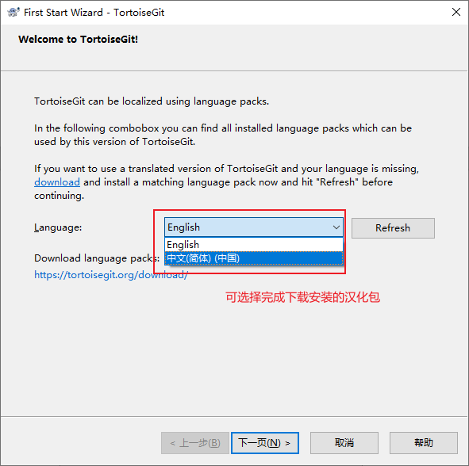

### Git已完成安装后，这会自动取到；若未完成安装git，需后续配置git安装位置

### Git用户和邮箱配置

---
---

# GitHub

## 访问网站

[https://GitHub.com](https://GitHub.com)

## 网站自动汉化插件安装方法及过程

<https://github.com/maboloshi/github-chinese>

### 点击安装源

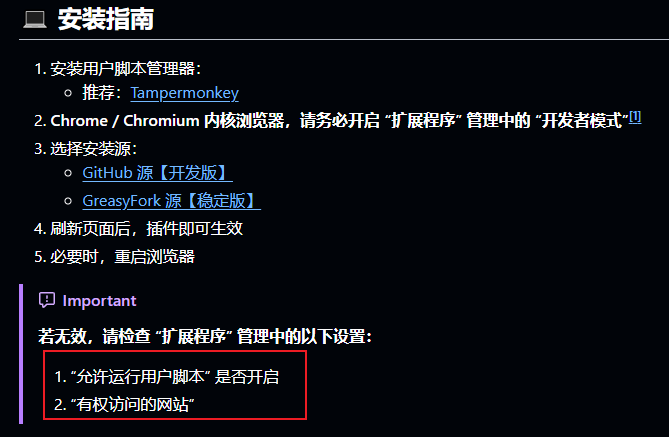

### 然后点击下载跳转

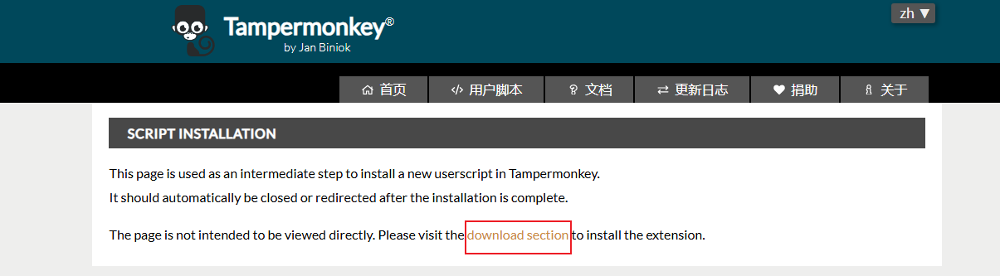

### 安装插件，刷新github
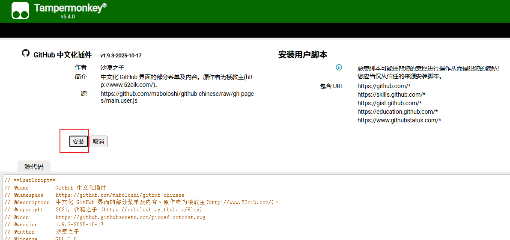

### 汉化结果展示
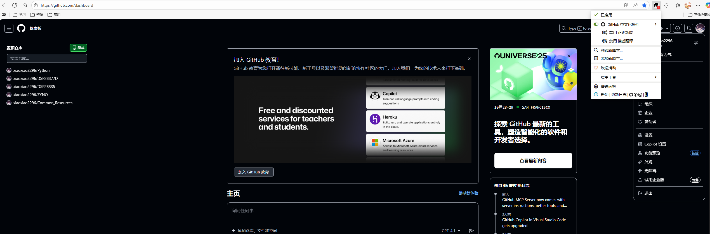

---
---

# C/C++环境

## 安装地址
[https://github.com/niXman/mingw-builds-binaries.git](https://github.com/niXman/mingw-builds-binaries.git)

## 安装过程

### 版本选择.可只选其一,或都安装
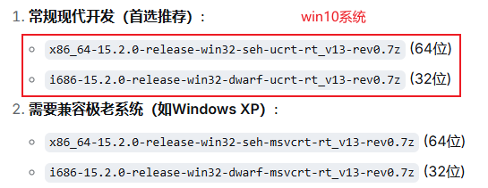

### 下载完成后，推荐解压放在C盘下
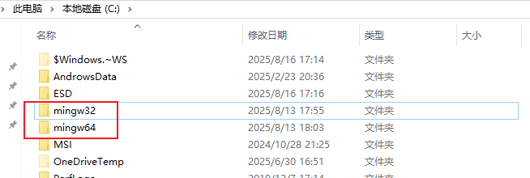

### 配置环境变量
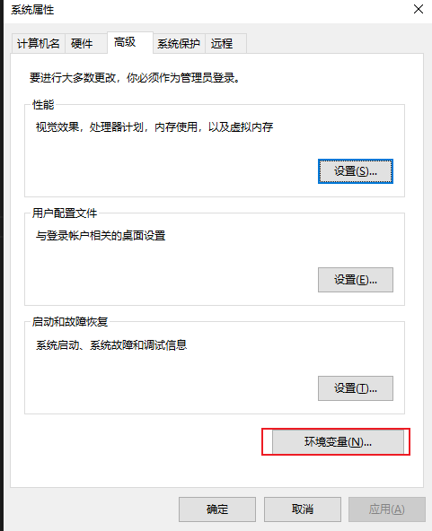

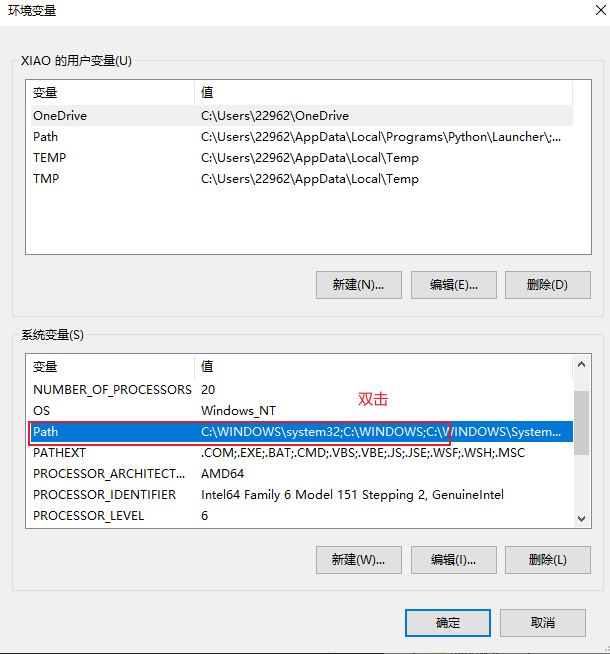

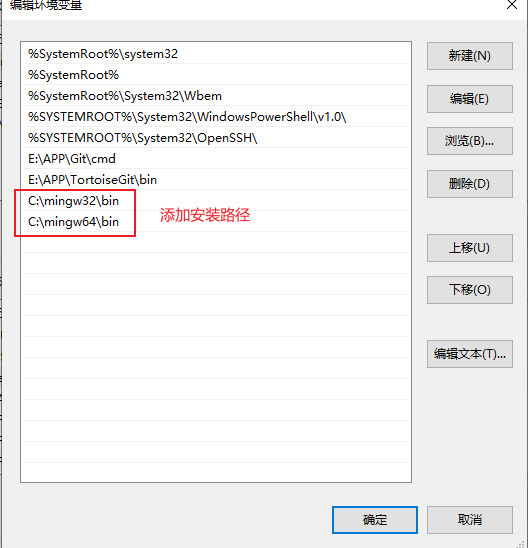

最后确认配置

### 重启电脑

### 验证是否安装成功
CMD命令行中输入下列命令
>gcc -v

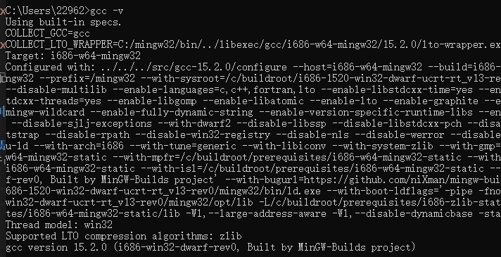

---
---

# STM32环境

## 需要安装
1. [C/C++ 的环境](#CC环境)
2. [STM32CubeMx](https://www.st.com.cn/zh/development-tools/stm32cubemx.html)
3. [cmake](https://cmake.org/download/)
4. [VSCODD](https://code.visualstudio.com/Download)
5. VSCODE插件-STM32CubeIDE for Visual Studio Code

## 安装过程
1. [参考视频](https://www.bilibili.com/video/BV1QfbpzGENy/?spm_id_from=333.337.search-card.all.click&vd_source=8f939b79f52937d6447ff8ec1fa25fb0)
2. cmake安装位置需要添加到环境变量（需检查，否则VSCODE 报CMAKE故障）

